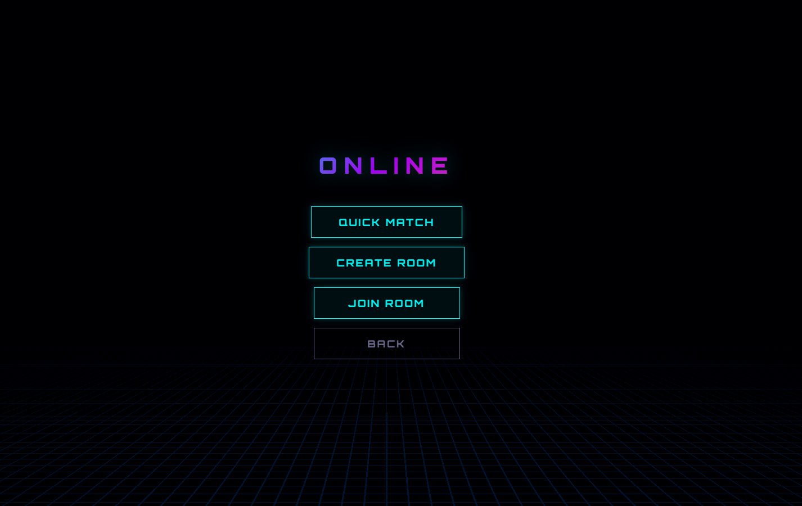
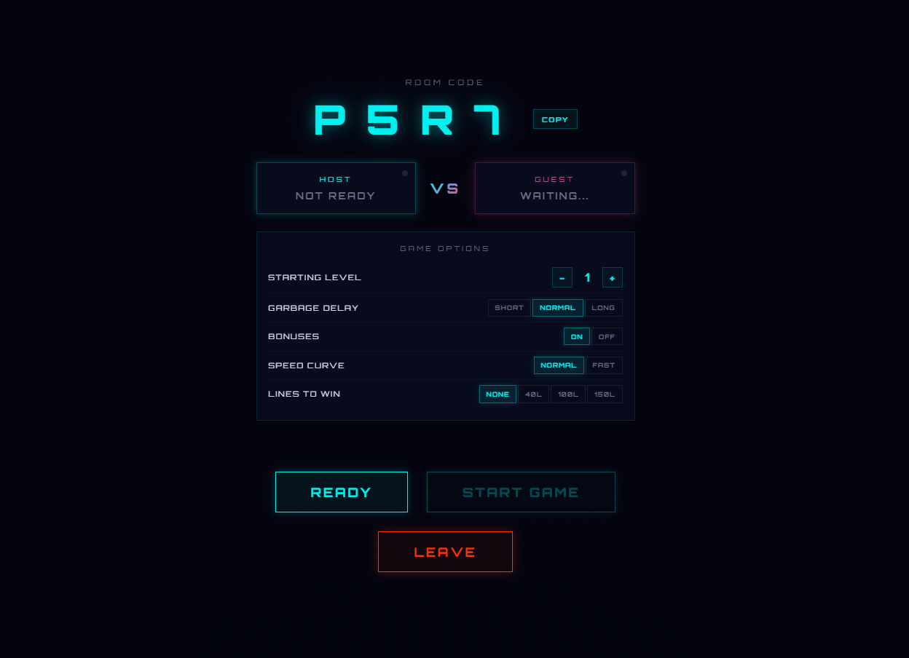
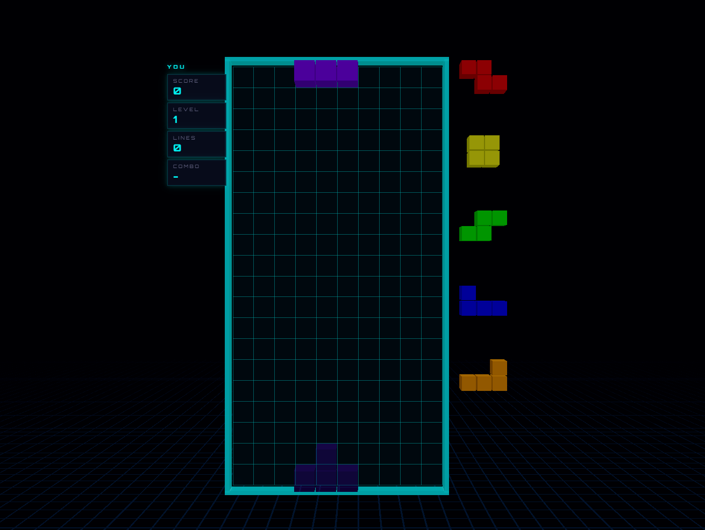

# Tetris Battle

A competitive 1v1 Tetris game playable in the browser. Built with Three.js (WebGPU renderer), Node.js, and Socket.IO.

## Screenshots

### Main Menu


### Room Lobby
Create a private room, share the code with a friend, and configure game options before the match starts.



### Solo Practice


### Live 1v1 Match


## Features

- **1v1 online multiplayer** — quick match (auto-matchmaking) or private rooms with a 4-character code
- **Game options** — starting level, garbage delay, speed curve, bonuses toggle, lines-to-win limit
- **Garbage attack system** — clear lines to send garbage rows to your opponent
- **Bonuses** — T-Spin, Tetris, Perfect Clear, Iron Well, Blackout, Phase Shift
- **3D renderer** — Three.js r172 with WebGPU (falls back to WebGL)
- **Background music** — loops and speeds up as your level increases
- **Volume control** — cycle between full / half / mute

## Controls

| Key | Action |
|---|---|
| ← → | Move |
| ↑ | Rotate clockwise |
| Z | Rotate counter-clockwise |
| ↓ | Soft drop |
| Space | Hard drop |
| C | Hold |

## Tech Stack

- **Client**: Three.js r172, Vite 6, vanilla JS
- **Server**: Node.js, Express, Socket.IO 4
- **Deployment**: Render.com (server serves built client in production)

## Running Locally

```bash
npm install
npm run dev
```

Open `http://localhost:5173`.

## Deployment

The project includes a `render.yaml` for one-click deploy on [Render.com](https://render.com).

1. Push to GitHub
2. New → Web Service on Render, connect the repo
3. Render auto-detects `render.yaml` and deploys
